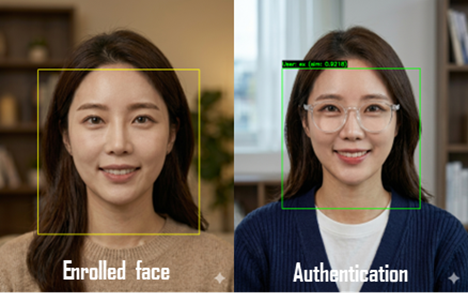

# **Face-Verifier**

`FaceVerifier` is a real-time face recognition library built on **OpenCV** and **DeepCore, (Deepixel’s proprietary library)**. It leverages TensorFlow Lite models for fast, anti-spoofing-enabled face recognition.

The system processes the entire pipeline from face detection to final verification in real time and provides:

* Real-time face detection and high-speed alignment
* Robust anti-spoofing functionality to block presentation attacks (such as photos and display screens)
* CPU-only optimized design for low-latency, standalone operations

The illustration below demonstrates how enrolled faces are authenticated.

---

### Features ###

* Real-time face detection and alignment
* Built-in Anti-spoofing (Presentation Attack Detection)
* High-speed face verification 
* CPU-only operation (Optimized for edge/desktop environments)

---

## **Installation**

*(To be updated)*

---

## **Performance**

`FaceVerifier`is optimized for real-time performance on CPU. Typical inference speeds:
##### 1. Accuracy
| Metric                | Performance | Condition / Remark  |
| :-------------------- | :---------- | :------------------ |
| Face Recognition Rate | **99.6%**   | -                   |
| Anti-Spoofing         | **97.8%**   | TPR @ FPR $10^{-5}$ |

##### 2. Inference Speed (Latency)
Typical inference speed:

| Environment | Resolution         | Latency     |
| :---------- | :----------------- | :---------- |
| Apple M1    | $1980 \times 2640$ | **31.7** ms |

---

## **Python Usage**

*(To be updated)*

---

## **API Reference**

*(To be updated)*

---

## **License**

This library is **proprietary and requires a paid license**. You may **not use, distribute, or modify** it without a valid license.

### How to Get a License
- Contact us via email: [support@deepixel.xyz](mailto:support@deepixel.xyz)

---

## **Image Credit**

The face image used in this README/demo was generated by **Nano Banana**. This image is **synthetic** and does not depict a real person.

---
